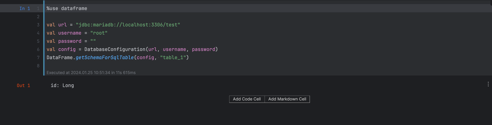
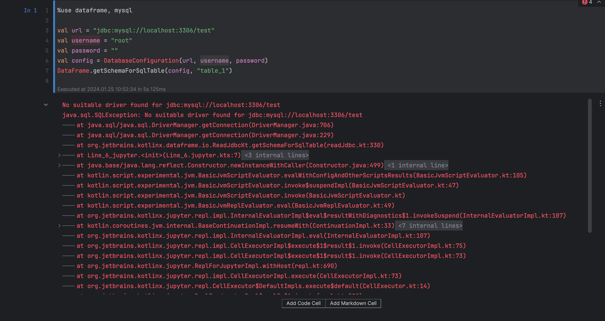

# kotlin-notebook-mysql

To reproduce dataframe db driver errors:
1. Have a local MySql8 database running on `localhost:3306` with user `root` with a blank password.
2. Run the [init.sql](init.sql) script to initiate database `test` with a single table `table_1` containing an `id` column of type `bigint`.
3. Running [dataframe-mariadb-test.ipynb](dataframe-mysql-test.ipynb) works and yields:
    
3. Running [dataframe-mysql-test.ipynb](dataframe-mysql-test.ipynb) does not work and yields:
   
